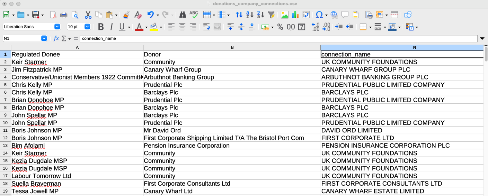
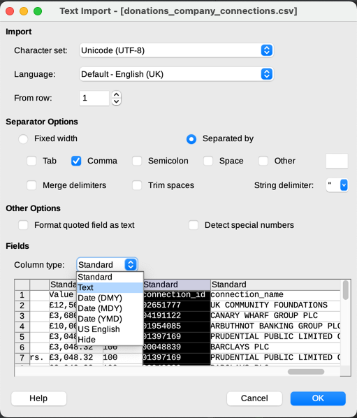

# companies_house_interface
## A command line application for pulling data from UK Companies House

The Companies House Interface (or chi for short) is a command line application for
pulling data from the UK Companies House, making connections between people and companies,
and then saving the data in various formats:
- Neo4j graph database
- json
- csv
- xlsx spreadsheets.

### Here is an example basic work flow:

Let's pick someone who directs multiple UK companies that we would like to look into.
For example the social media landlord Samuel Leeds:

You then go to the webpage's url and copy the officer id, in this example it is
"c9MBFivRCmMdFZqdtmTcJnBqd54".

You then take the id and perform the following command:
**chi createnetwork -oid c9MBFivRCmMdFZqdtmTcJnBqd54**

chi will then pull all of Samuel Leeds data, the data of all the companies that he directs,
the data of all the people that also direct those companies, and then the data of all
the companies that they direct. It will then add this data to a Neo4j graphDB
visualising the business network.

### Finding political connections work flow:

Once you have created a network pulled from Companies House data you can then extend it to find connections in various
political data sets, although currently the only one that has been implemented is the UK Electoral Commission's register
of interests.

>[!NOTE]
> This is more involved than the most basic example, it is a multistep process that requires your own input
> and judgement.

This time lets use a more political entwined example: The Global Warming Policy Foundation.

In the same way that you extracted the officer id in the last example this time you go to the url and find the company 
number. For the GWPF it is "06962749".

You then create the basic network with the createnetwork command

**chi createnetwork -cn 06962749 --save_neo4j False --save_json_path "~/example_user/data/gwpf_network.json"** 

Let's just walk through all the parameters here:
- '-cn 06962749' This time we are starting the network from a company rather than an officer, so we are using the --company_number parameter rather than --officer_id like before.  
- '--save_neo4j False' The default behaviour is to save the network to a neo4j db so that you can view a graph of the network to gain insights. However, in this instance the network that we are creating is going to be used as an intermediary in the creation of a more complex network, so we won't need to look at it at this stage. You could still create the graph it if you desire, but it isn't required.   
- '--save_json_path ...' To move onto the next step in this workflow we do require the network to be saved to json, if this parameter is not used then this will not happen. So, we need to give it a path to the save location of our new network. Be advised that this function will overwrite anything currently saved at the given location.

Once our basic network has been created from Companies House data and saved to json we can call the next command, fppc
(find_potential_political_conections)

**chi fppc --load_path "~/example_user/data/gwpf_network.json" --connections_directory "~/example_user/data/gwpf_connections"**

Just two parameters this time:
- '--load_path ...' The path to the json file storing out basic network.
- '--connections_directory' This is the directory where all the connections data will be stored.

>[!NOTE]
> The program requires the files stored in the connections directory to adhere to exact naming conventions, only change
> names when instructed and in the exact ways prescribed.

Running this command may take a few minutes, even longer if you have a large starting network, so you may want to go 
and make a cup of tea.

If all has worked, in the connections directory the program will have created two new files for each political list that it has cross-referenced,
currently only the register of interests (donations) has been implemented so there will be just two files:
*donations_potential_company_connections.csv*
*donations_potential_officer_connections.csv*

This is the part that requires your input and judgement (fun!). The program uses a fuzzy matching algorythm to find
potential matches between the nodes in your network and entities in the lists. However, this is not perfect and requires
you to make a judgement call on if it is really a match. The program will have kept only the best matches
and ordered them from strongest to weakest, so you can work down the list until you think that you've moved past the realm
of realistic connections and stop there. You need to work through the list and take only the ones that you believe are 
genuine connections and save that list to a new file in the same directory with the exact same name just with 'potential'
deleted. so for example 
*donations_company_connections.csv*

I've found the easiest way to do this is to open the potential connections csv in a spreadsheet, hide the columns
between the name and potential name, work down the list deleting rows where the fuzz has given a false positive, until 
you reach a point in the list where there clearly aren't any more hits and delete all rows below.

>[!WARNING]
> When opening a csv into a spreadsheet unwanted formatted can be carried out, specifically stripping leading 0s from the 
> company_number. To stop this from happening when using the import wizard make sure you set the data type for connection_id to 'Text'. 

Once you have saved your two confirmed connections csvs you can add them to your network by calling the apctn 
(add_political_connections_to_network) command:

**chi apctn --load_path "~/example_user/data/gwpf_network.json" --connections_directory "~/example_user/data/gwpf_connections" --updated_network_save_path "~/example_user/data/gwpf_expanded_network.json"**

- '--load_path' Is, again, the location of your basic network.
- '--connections_directory' The same connections directory that you used before.
- '--updated_network_save_path' The location to save your new expanded network.

Once this has run successfully you can then call 

**chi loadjsoncreategraph --load_path "~/example_user/data/gwpf_expanded_network.json"**

To save your new expanded network to neo4j so that you can view it as a graph!

## Setup and Requirements

### pip
chi is not currently listed on PyPI, so you will have to clone this repo and then install it as an editable package:
- Clone the repo.
- cd to the directory.
- Run this command "pip install -e ."

### Companies House account
chi uses the Companies House api which requires a user key, in order to generate this key you need to make an account.
You can register for an account on the companies house site (search "companies house account register").
Once you have registered an account you need to go to the Companies House Developers Hub and Create an application.
This application will then generate an api key.

### Neo4j
In order to use chi you will need to have a Neo4j Graph DB setup and running. A tutorial on how to do this can be found
on their site https://neo4j.com/docs/getting-started/get-started-with-neo4j/

### Config

Once you have a Companies House api key and a Neo4j Graph DB running you can set up your chi config by running the
following command:
"chi setconfig"
You will then be prompted to enter 4 things:
- 'normal_key' your Companies House api key 
- 'uri' your Neo4j graph db's uri.
- 'username': your Neo4j username (this is normally 'neo4j').
- 'pw' your Neo4j graph db's password.

## Commands

**setconfig**
> [!WARNING]
> This command must be run before any others will work. You can run it again at anytime to change the config values.

| parameter  | long         | short |
|------------|--------------|-------|
| normal key | --normal_key | -nk   | 
| uri        | --uri        | -uri  |
| username   | --username   | -un   |
| password   | --pw         | -pw   |

**createnetwork**

| parameter             | long                 | short | default |
|-----------------------|----------------------|-------|---------|
| Officer ids           | --officer_ids        | -oid  | []      | 
| Company Numbers       | --company_numbers    | -cn   | []      |
| Network layers        | --layers             | -l    | 1       |
| Appointments limit    | --appointments_limit | -al   | 100     |
| Save Network to Json  | --save_json_path     | -sjp  | ""      |
| Save Network to csvs  | --save_csvs_path     | -scp  | ""      |
| Save Network to xlsx  | --save_xlsx_path     | -sxp  | ""      |
| Save Network to Neo4j | --save_neo4j         | -sgdb | True    |
| Overwrite Neo4j       | --overwrite_neo4j    | -own  | False   |

> [!NOTE]
- --officer_ids, can be called multiple times if you wish to start from multiple people.
- --company_numbers can be called multiple times if you wish to start from multiple companies.
- You can start a network from as many companies and officers as you like.
- --layers refers to how many times you wish to expand the business networks layers. It defaults to 1, which means that
 it fetches the data of the starting officers, their companies, the other officers of those companies and all of their 
 companies. Each subsequent layer repeats this proces expanding outward, it is not recommended to set this higher than
 2 or 3 as the networks can become extremely large.
- --appointment_limit filters out any officer with a large number of appointments. There are some people and organisations
 that sit on the board of thousands of companies. Expanding a network from one of these officers could lead to the network 
 expanding to 10 or 100s of thousands of nodes.
- The save_x_path arguments default to "", if not set to anything else files will not be saved.
- --save_neo4j defaults to True
- saving csvs writes multiple csv files, so you must provide a path to an existing directory that you wish to write to 
 rather than a path to the .csv files that you want to create.

> [!Warning]
> The save_x_path commands are destructive, they will overwrite any contents of files stored at save locations.

### if you have saved a network to json you can convert it to a Neo4j graph DB, csvs or xlsx.

- **loadjsoncreategraph**

| parameter       | long              | short | default |
|-----------------|-------------------|-------|---------|
| load path       | --save_path       | -sp   | None    |
| save path       | --load_path       | -lp   | None    |
| Overwrite Neo4j | --overwrite_neo4j | -own  | False   |

- **loadjsonsavecsvs**
- **loadjsonsavexlsx**

| parameter | long        | short | default |
|-----------|-------------|-------|---------|
| load path | --save_path | -sp   | None    |
| save path | --load_path | -lp   | None    |

### For expanding a network to include political connections use these two commands
####  consult workflow example for guidance on use

- fppc (*find_potential_political_connections*)

| parameter             | long                    | short | default |
|-----------------------|-------------------------|-------|---------|
| load path             | --save_path             | -sp   | None    |
| connections directory | --connections_directory | -cdp  | None    |

- apctn (*add_potential_political_connections*)

| parameter                 | long                        | short | default |
|---------------------------|-----------------------------|-------|---------|
| load path                 | --save_path                 | -sp   | None    |
| connections directory     | --connections_directory     | -cdp  | None    |
| updated network save path | --updated_network_save_path | -unsp | None    |

(load_path, updated_network_save_path, connections_directory_path)

## Issues and contact

This is an early alpha, so there may still be kinks that I haven't come across and ironed out yet. If
you run into any issues, need a hand setting up, or have any suggestions contact me on Twitter @edcarron. I have my dms
open and would love to hear from people!